# Variational Autoencoders in Non-Linear Mixed Effects Modeling — R Port

R translation of the Python codebase accompanying the paper:

> **Redefining Parameter Estimation and Covariate Selection via Variational Autoencoders: One Run Is All You Need**  
> Jan Rohleff, Freya Bachmann, Uri Nahum, Dominic Bräm, Britta Steffens, Marc Pfister, Gilbert Koch, Johannes Schropp  
> *CPT: Pharmacometrics & Systems Pharmacology*, 2025 — https://doi.org/10.1002/psp4.70129

The original Python code is at https://github.com/janrohleff/vae_nlme.

---

## Overview

The R port implements the full VAE-NLME framework using `torch` for R in place of PyTorch,
`CVXR` + `ECOS_BB` in place of `cvxpy` + Gurobi, and `ggplot2` / `patchwork` for
visualisation. All seven case studies from the paper are supported.

| Python component | R equivalent |
|---|---|
| `torch` / PyTorch LSTM | `torch` for R — `lstm_encoder` (`nn_module`) |
| Analytical PK decoders | R torch tensor ops — `decoder_theophylline()`, etc. |
| `torchode` (neonates ODE) | Batched RK4 in R torch — `decoder_neonates()` |
| `cvxpy` + Gurobi (MIQP) | `CVXR` + `ECOS_BB` — `pop_parameter` R6 class |
| `scipy.optimize` (EBE) | `optim()` Nelder-Mead — `EmpiricalBayesEstimate_theo()` |
| `matplotlib` | `ggplot2` + `patchwork` |

---

## Installation

```r
install.packages(c(
  "torch", "R6", "CVXR", "ECOSolveR",
  "ggplot2", "patchwork",
  "nlmixr2data"           # benchmark datasets
))
library(torch)
install_torch()           # downloads LibTorch (~500 MB, one-time)
```

Optional — for Word (`.docx`) results export:
```r
install.packages(c("officer", "flextable"))
```

---

## Repository structure

```
VAE_R/
├── R/
│   ├── encoder.R              LSTM Encoder (nn_module, full Cholesky)
│   ├── decoder.R              All PK decoders (analytical + RK4 ODE)
│   ├── functions.R            ELBO / log-likelihood / burn-in + save/load RDS
│   ├── pop_parameter.R        Population parameter update via MIQP (BICc)
│   ├── functions_theo.R       Data loading for theophylline (single & multiple)
│   ├── functions_neonates.R   Data loading for neonates weight dataset
│   ├── functions_warfarin.R   Data loading for warfarin
│   ├── functions_pheno.R      Data loading for pheno_sd (multi-dose IV)
│   ├── functions_mavo.R       Data loading for mavoglurant (2-cmt IV infusion)
│   ├── functions_nimo.R       Data loading for nimoData (occasion-split IV)
│   └── visualization.R        Convergence plots, VPC, PPC, results export
├── Main/
│   ├── theophylline.R         Case study 1a — 1-cmt oral, single dose
│   ├── theophylline_multiple.R  Case study 1b — 1-cmt oral, multiple dosing
│   ├── neonates.R             Case study 2  — neonatal weight (ODE, no covariate sel.)
│   ├── warfarin.R             nlmixr2data::warfarin — 1-cmt oral
│   ├── pheno_sd.R             nlmixr2data::pheno_sd — 1-cmt IV multi-dose
│   ├── mavoglurant.R          nlmixr2data::mavoglurant — 2-cmt IV infusion
│   ├── nimoData.R             nlmixr2data::nimoData — 1-cmt IV, occasion-split
│   └── regenerate_results.R   Reload saved fits → regenerate all tables & plots
├── Data/                      Raw data files (shared with Python project)
├── Results/                   Saved .rds fits + encoder .pt weights
└── Plots/                     Output PDFs / JPGs written here
```

---

## Running the examples

Open an R session with the working directory at `VAE_R/`, or source from RStudio.

```r
source("Main/theophylline.R")          # single dose
source("Main/theophylline_multiple.R") # multiple dosing
source("Main/neonates.R")              # neonates ODE
source("Main/warfarin.R")
source("Main/pheno_sd.R")
source("Main/mavoglurant.R")
source("Main/nimoData.R")
```

Each script trains the VAE-NLME model end-to-end, prints parameter estimates and
information criteria to the console, saves convergence/covariate plots to `Plots/`,
exports results as CSV / LaTeX / Word to `Results/`, and serialises the fitted model
to `Results/<dataset>_fit.rds` + `Results/<dataset>_encoder.pt`.

### Regenerating results without retraining

```r
source("Main/regenerate_results.R")
```

Loads all saved `.rds` fits and recreates every table and plot — useful after
changing plot styles or result formatting.

---

## Outputs per dataset

Each main script produces:

| Output | Location | Format |
|---|---|---|
| Convergence plot (ELBO, parameters) | `Plots/<dataset>_convergence.pdf/.jpg` | PDF + JPG |
| Covariate selection convergence | `Plots/<dataset>_convergence_covariate.pdf/.jpg` | PDF + JPG |
| VPC (Visual Predictive Check) | `Plots/<dataset>_vpc.pdf/.jpg` | PDF + JPG |
| PPC (Posterior Predictive Check) | `Plots/<dataset>_ppc.pdf/.jpg` | PDF + JPG |
| Parameter table | `Results/<dataset>_results.csv` | CSV |
| Parameter table (LaTeX) | `Results/<dataset>_results.tex` | `.tex` snippet |
| Parameter table (Markdown) | `Results/<dataset>_results.md` | Markdown |
| Parameter table (Word) | `Results/<dataset>_results.docx` | `.docx` |
| Saved model | `Results/<dataset>_fit.rds` + `_encoder.pt` | R list + torch weights |

### VPC vs PPC

- **VPC** — samples individual parameters from the *marginal population distribution*
  `z_i ~ N(C_i z_pop, Ω)`. Checks whether the population model is well specified.
- **PPC** — samples from the *encoder posterior* `q(z|x_i) = N(μ_i, L_i L_iᵀ)` for
  each subject's observed data. Checks individual-level fit.

Both plots show a 90 % prediction interval (blue band), the median (gold line),
observed percentiles (red / black lines), and optionally the raw observations (grey).

### Time After Last Dose (TALD)

For multiple-dose datasets the x-axis can be switched to *time after last dose* for
cleaner visualisation across dose cycles (analogous to Monolix's TAD display).
This is on by default for `theophylline_multiple` and `pheno_sd`:

```r
plot_vpc_theo_mult(..., tald = TRUE,  nbins = 10)   # default
plot_vpc_pheno(...,     tald = TRUE,  nbins = 8)    # default
plot_vpc_theo_mult(..., tald = FALSE, nbins = 10)   # absolute time
```

---

## Results gallery

### 1 · Theophylline — single dose (1-cmt oral, N = 12)

**Convergence traces**

| Population parameters | Covariate selection |
|---|---|
| 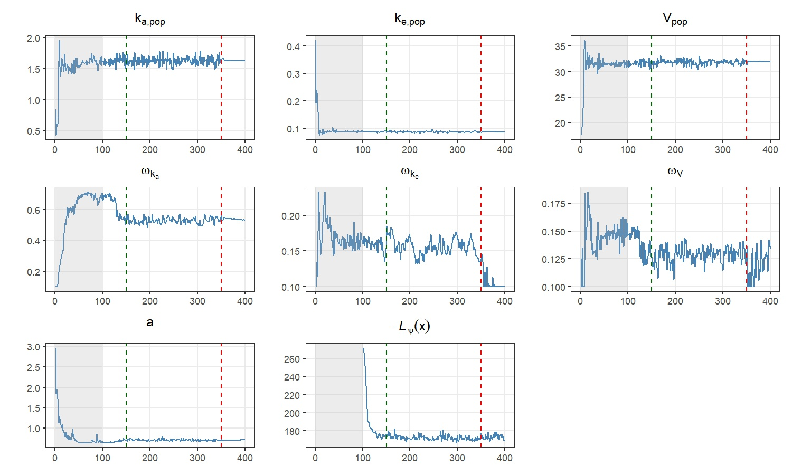 | 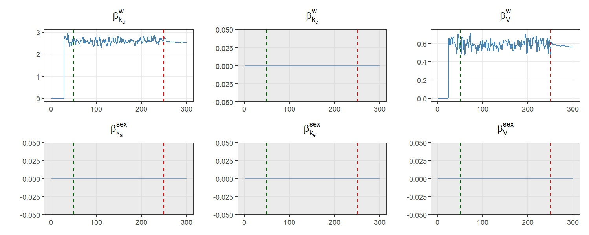 |

**Visual Predictive Check (VPC) and Posterior Predictive Check (PPC)**

| VPC | PPC |
|---|---|
| 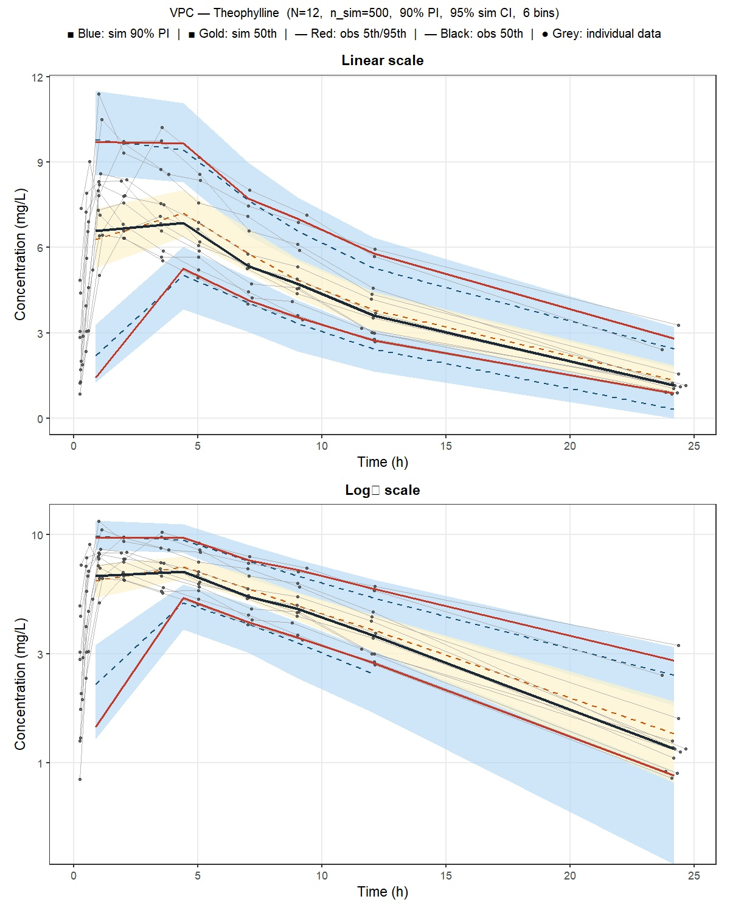 | 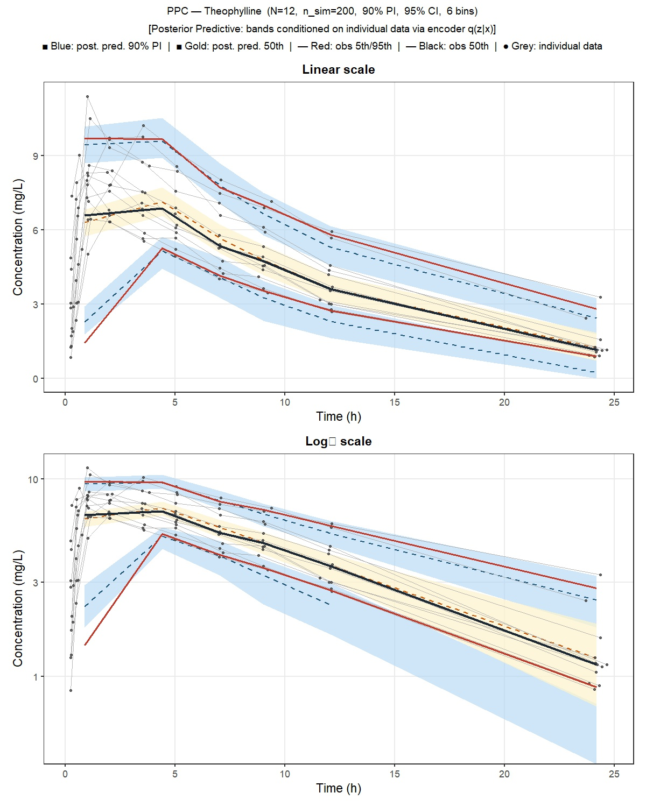 |

**Parameter estimates**

| Section | Parameter | Linearisation | Imp. Sampling |
|---|---|---|---|
| Fixed Effects | ka_pop | 1.6289 | — |
| Fixed Effects | ke_pop | 0.0865 | — |
| Fixed Effects | V_pop | 31.9471 | — |
| Covariate Effects | beta_ka_weight | 2.5400 | — |
| Covariate Effects | beta_V_weight | 0.5618 | — |
| Random Effects (SD) | omega_ka | 0.5329 | — |
| Random Effects (SD) | omega_ke | 0.1000 | — |
| Random Effects (SD) | omega_V | 0.1343 | — |
| Error Model | a | 0.7095 | — |
| IC | OFV | 331.18 | 332.80 |
| IC | AIC | 349.18 | 350.80 |
| IC | BIC | 353.54 | 355.16 |
| IC | BICc | 362.75 | 364.37 |

---

### 2 · Warfarin (1-cmt oral, N = 32)

**Convergence traces**

| Population parameters | Covariate selection |
|---|---|
| 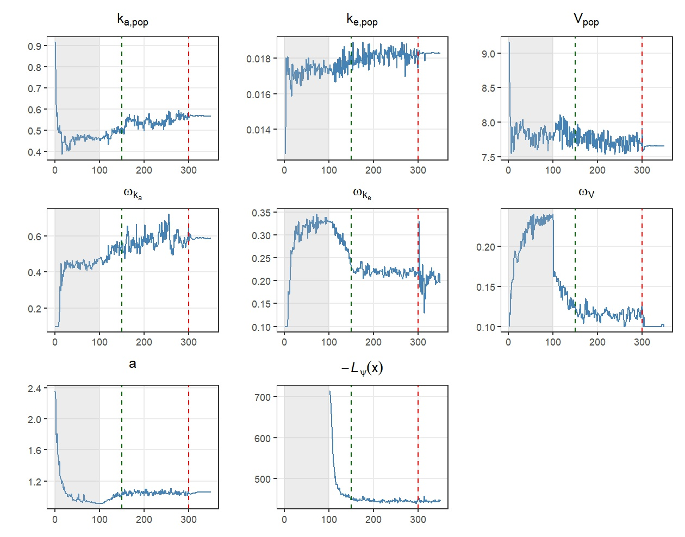 | 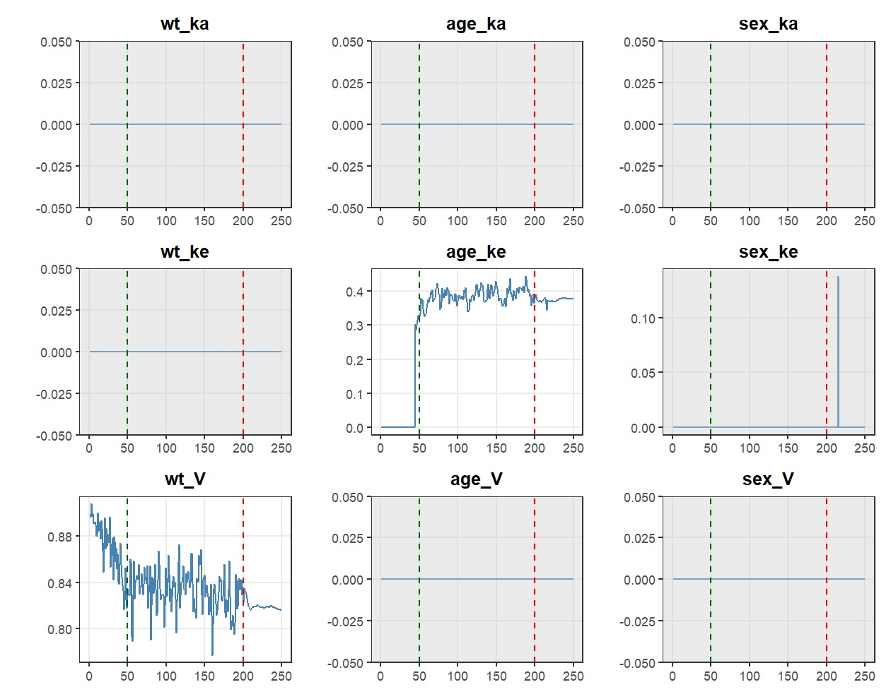 |

**VPC and PPC**

| VPC | PPC |
|---|---|
| 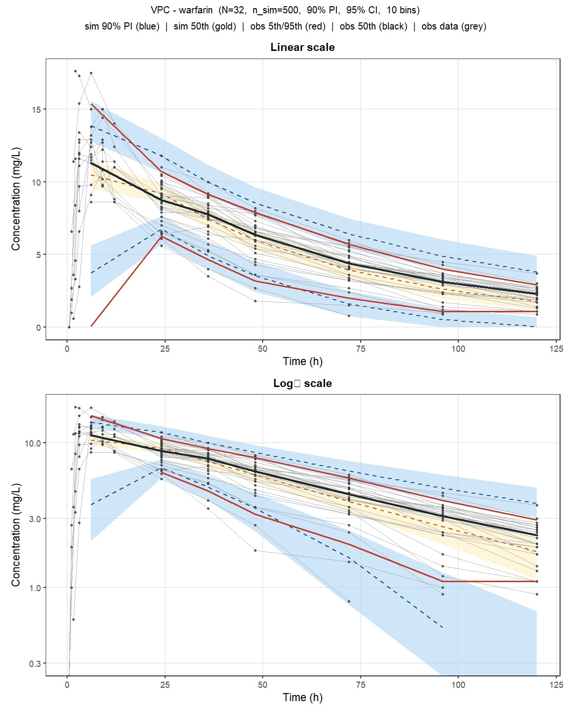 | 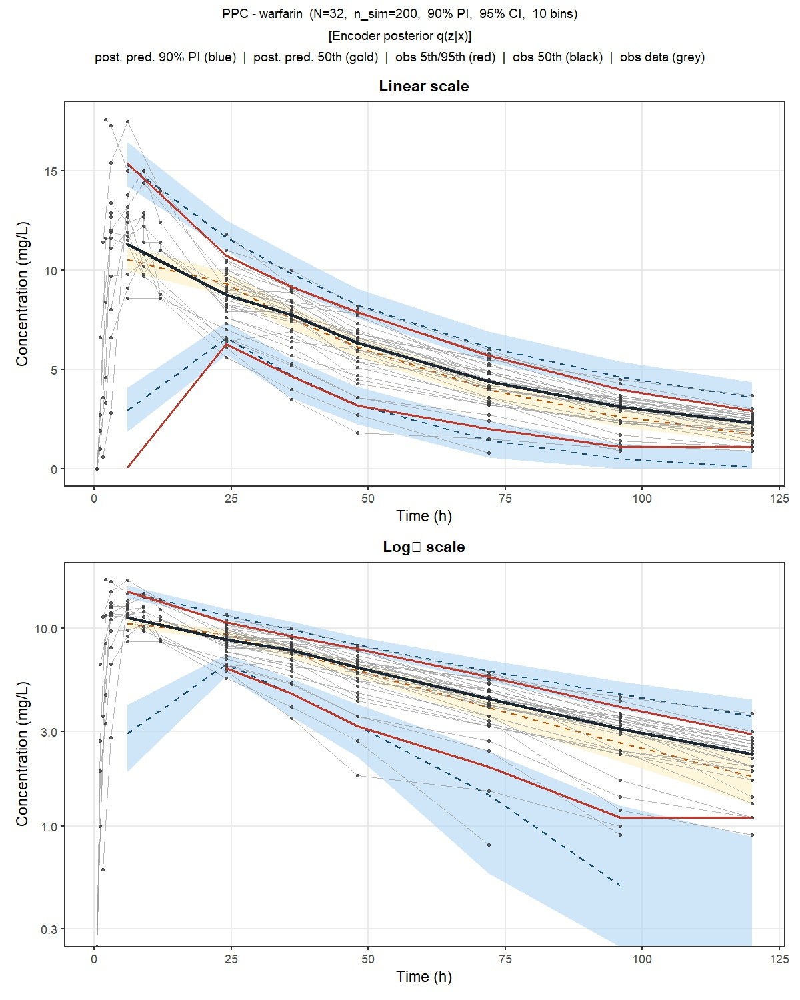 |

**Parameter estimates**

| Section | Parameter | Linearisation | Imp. Sampling |
|---|---|---|---|
| Fixed Effects | ka_pop | 0.5686 | — |
| Fixed Effects | ke_pop | 0.0183 | — |
| Fixed Effects | V_pop | 7.6562 | — |
| Covariate Effects | age_ke | 0.3758 | — |
| Covariate Effects | wt_V | 0.8158 | — |
| Random Effects (SD) | omega_ka | 0.5866 | — |
| Random Effects (SD) | omega_ke | 0.1965 | — |
| Random Effects (SD) | omega_V | 0.1000 | — |
| Error Model | a | 1.0571 | — |
| IC | OFV | 869.56 | 872.40 |
| IC | AIC | 887.56 | 890.40 |
| IC | BIC | 900.75 | 903.59 |
| IC | BICc | 908.99 | 911.83 |

---

### 3 · Neonates — weight dynamics (ODE, N = 68)

**Convergence traces**

| Population parameters | Covariate selection |
|---|---|
| 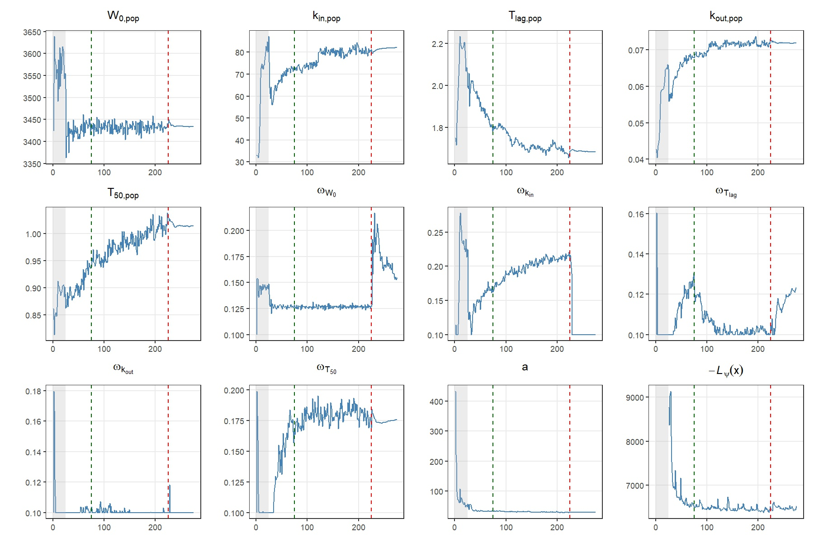 | 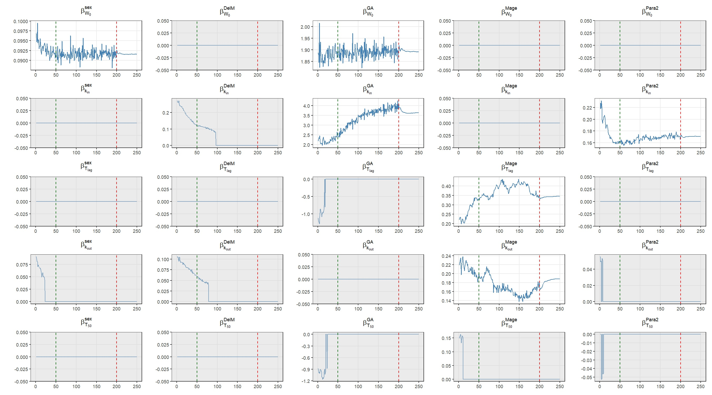 |

**VPC and PPC**

| VPC | PPC |
|---|---|
| 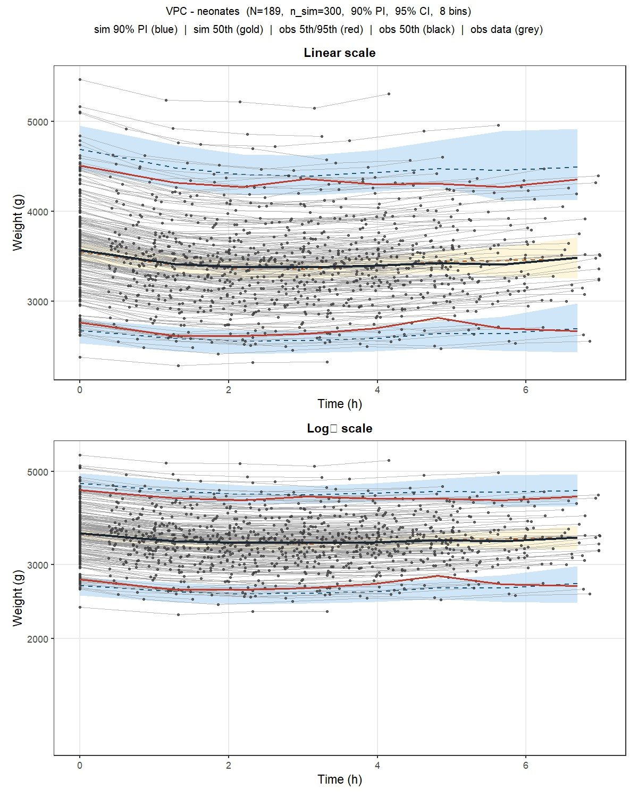 | 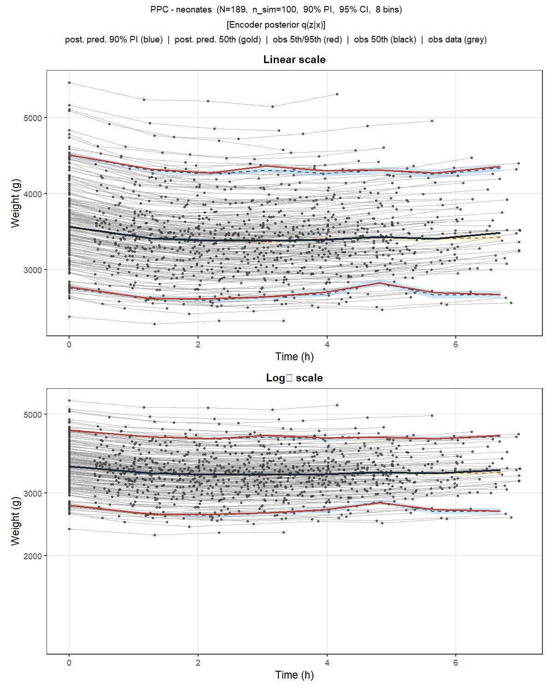 |

**Parameter estimates**

| Section | Parameter | Linearisation | Imp. Sampling |
|---|---|---|---|
| Fixed Effects | W0_pop | 3433.84 | — |
| Fixed Effects | kin_pop | 82.0532 | — |
| Fixed Effects | Tlag_pop | 1.6827 | — |
| Fixed Effects | koutmax_pop | 0.0718 | — |
| Fixed Effects | T50_pop | 1.0137 | — |
| Covariate Effects | Sex_W0 | 0.0916 | — |
| Covariate Effects | GAexact_W0 | 1.8922 | — |
| Covariate Effects | GAexact_kin | 3.6418 | — |
| Covariate Effects | Para2_kin | 0.1709 | — |
| Covariate Effects | Mage_TL | 0.3455 | — |
| Covariate Effects | Mage_kout | 0.1880 | — |
| Random Effects (SD) | omega_W0 | 0.1548 | — |
| Random Effects (SD) | omega_kin | 0.1000 | — |
| Random Effects (SD) | omega_Tlag | 0.1231 | — |
| Random Effects (SD) | omega_koutmax | 0.1000 | — |
| Random Effects (SD) | omega_T50 | 0.1759 | — |
| Error Model | a | 30.7881 | — |
| IC | OFV | 12692.04 | 12715.11 |
| IC | AIC | 12726.04 | 12749.11 |
| IC | BIC | 12781.15 | 12804.22 |
| IC | BICc | 12791.83 | 12814.90 |

---

## Key design notes

### Encoder

Single LSTM layer followed by a full **Cholesky head** (lower-triangular L) and a mean
head (μ). The reparameterisation trick gives **z = μ + L ε**, ε ~ N(0, I), which
propagates gradients through z during backpropagation.  
Output biases are initialised to physiological priors (`h⁻¹(μ₀)` and `σ₀`).

### Population parameter update (MIQP)

The BICc-penalised ELBO (Eqs. 12–13 in the paper) is solved each outer iteration:

```
min   ½ θᵀ Q θ − cᵀ θ  +  log(N)/2 · ‖β‖₀
s.t.  |βₖ| ≤ M · γₖ,   γₖ ∈ {0,1}
```

**Q** and **c** are assembled from encoder posterior means.  
Solved with `CVXR::solve(..., solver = "ECOS_BB")` with automatic fallback to an
unconstrained QP if the mixed-integer solver fails.

### Decoders

| Dataset | Model | Decoder function |
|---|---|---|
| theophylline (single) | 1-cmt oral | `decoder_theophylline()` |
| theophylline (multiple) | 1-cmt oral superposition | `decoder_theophylline_multiple()` |
| neonates | ODE (weight dynamics) | `decoder_neonates()` — batched RK4 |
| warfarin | 1-cmt oral | `decoder_warfarin()` |
| pheno_sd | 1-cmt IV multi-dose superposition | `decoder_pheno_1cmt()` |
| mavoglurant | 2-cmt IV infusion | `decoder_mavoglurant()` |
| nimoData | 1-cmt IV infusion | `decoder_nimo_1cmt()` |

The neonates decoder replaces `torchode` with a **fixed-step batched RK4** implemented
entirely with R torch tensor operations, preserving full differentiability.

### Save / load

`save_vae_fit()` serialises all fitted arrays (z_pop, omega_pop, C, a, b, data, lengths,
covariates, and any dataset-specific tensors such as `dose`, `dose_times`, `rate`,
`t_inf`) to `Results/<dataset>_fit.rds` and the encoder state dict to
`Results/<dataset>_encoder.pt`.

`load_vae_fit()` reconstructs all tensors and re-instantiates the encoder module ready
for inference — no retraining required.

---

## Dependencies

| Package | Role |
|---|---|
| `torch` | Neural network, autograd, Adam optimiser |
| `R6` | OO framework for `pop_parameter` class |
| `CVXR` | Convex / mixed-integer optimisation (MIQP) |
| `ECOSolveR` | ECOS_BB mixed-integer solver backend |
| `ggplot2` | All plots |
| `patchwork` | Multi-panel plot layout |
| `nlmixr2data` | Benchmark datasets (warfarin, pheno_sd, mavoglurant, nimoData) |
| `officer` | *(optional)* Word `.docx` results export |
| `flextable` | *(optional)* Formatted tables in Word |

